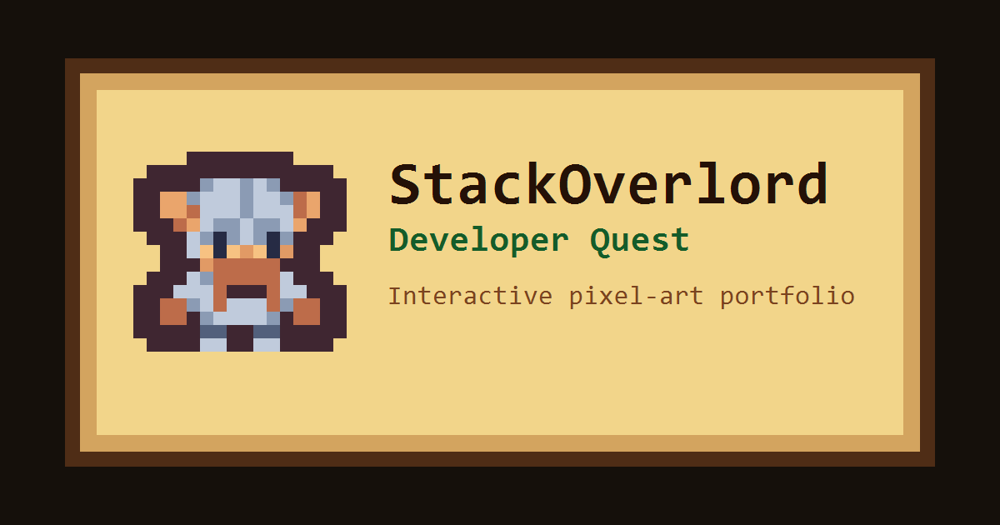

# StackOverlord: Developer Quest



Interactive developer portfolio built as a small pixel-art game.

Instead of a traditional landing page, this project presents portfolio content through explorable scenes, NPC interactions, modal windows and a survival arena with an online leaderboard.

## Overview

StackOverlord: Developer Quest is a React + Phaser portfolio experience. The player starts from a menu, enters a small world, talks to a mage, reaches a hub area, opens CV/About content through NPCs and can enter an arena combat scene.

The app uses React for the DOM shell and portfolio modals, while Phaser manages the game canvas, scenes, movement, collisions, dialogue, audio, combat and scene transitions.

## Live Demo

https://stackoverlord-developer-quest.vercel.app/

## Features

- Pixel-art game portfolio experience.
- Phaser scene flow: menu, intro room, hub and combat arena.
- Keyboard controls on desktop.
- Virtual joystick and touch buttons on mobile.
- Platform-specific control hints for desktop and touch devices.
- Typewriter dialogue with speech sound.
- React modals for CV and About content.
- Persistent music preference across scenes.
- Survival arena with rounds, enemies, score and local game-over flow.
- Supabase-powered combat leaderboard.
- `localStorage` fallback when Supabase is not configured or unavailable.
- Real mobile name input for arena leaderboard submissions.
- Social preview metadata for shared links.
- Responsive fullscreen canvas using Phaser scale handling.

## Desktop Controls

| Key | Action |
| --- | --- |
| Arrow keys | Move |
| Enter | Start game from the menu |
| E | Interact, continue, retry or save depending on context |
| Space | Attack in the arena |
| M | Toggle scene music |
| Esc | Go back or close modal depending on context |

## Mobile Controls

| Control | Action |
| --- | --- |
| Virtual joystick | Move |
| A | Start, interact, continue, attack, retry or submit depending on context |
| Back | Go back or close modal depending on context |
| M | Toggle music |

Arena name entry uses a real HTML text input on touch devices so mobile keyboards can open correctly.

## Tech Stack

- React 19
- TypeScript
- Vite
- Phaser 3.90
- Tiled
- Tailwind CSS
- Supabase
- ESLint

## Project Architecture

The project is split between React and Phaser responsibilities:

- React mounts the application shell, owns DOM modals and listens to UI events.
- Phaser owns the game loop, scenes, physics, tilemaps, player movement, combat and audio.
- Tiled is used to build the game maps and export JSON tilemaps consumed by Phaser.
- A small typed event bus connects Phaser scenes with React UI.
- Supabase stores the public arena leaderboard.
- Static assets are served from `public/assets`.

## Folder Structure

```text
src/
  components/
    CombatNameInput.tsx   Mobile HTML input for arena name entry
    GameCanvas.tsx        React wrapper around the Phaser game
    MobileControls.tsx    Virtual joystick and touch action buttons
    PortfolioModal.tsx    CV and About modal content
  game/
    BootScene.ts          Starts the Phaser scene flow
    MenuScene.ts          Title screen and start flow
    PlayScene.ts          Intro room, mage dialogue and transition to Hub
    HubScene.ts           NPC hub for CV, About and Arena
    CombatScene.ts        Survival arena gameplay
    combat/
      hud.ts              Combat HUD builders
      ranking.ts          Ranking storage layer with Supabase + fallback
      supabaseClient.ts   Supabase client setup
      types.ts            Combat-related TypeScript types
    events/
      events.ts           Typed Phaser-to-React event bus
    input/
      inputMode.ts        Platform-specific control hint labels
      virtualInput.ts     Shared touch input state for Phaser scenes
    ui/
      musicControl.ts     Shared music toggle UI
      musicState.ts       Global music preference state
public/
  assets/                 Pixel art, tilemaps, audio, CV PDF and social images
supabase/
  combat-ranking.sql      SQL setup for the combat leaderboard
```

## Game Flow

1. `MenuScene` shows the title screen and starts the game.
2. `PlayScene` introduces the world through a mage dialogue.
3. `HubScene` lets the player interact with CV, About and Arena NPCs.
4. `CombatScene` starts the survival arena and leaderboard flow.
5. The arena returns to the Hub with `Esc` on desktop or `Back` on mobile.

## Maps and Scene Design

The playable rooms and arena are built from Tiled JSON maps using the pixel-art assets in `public/assets`.

Phaser loads those maps as tilemaps, creates the `Ground`, `Walls` and `Decoration` layers, and uses collision properties from the map layers to keep player movement and scene boundaries consistent.

## Supabase Leaderboard

Supabase is used to store the arena leaderboard in the `combat_ranking` table.

The leaderboard keeps one entry per `player_id` and the SQL trigger in `supabase/combat-ranking.sql` prevents a lower score from replacing a better one.

If Supabase is not configured or the request fails, the game falls back to `localStorage` so the arena remains playable.

This leaderboard is suitable for a public portfolio/demo game. Scores are not server-verified, so a production competitive leaderboard would require a backend validation layer.

## Environment Variables

Copy `.env.example` into `.env.local` and fill in your Supabase project values:

```env
VITE_SUPABASE_URL=
VITE_SUPABASE_PUBLISHABLE_KEY=
```

Only use Supabase publishable/client-safe keys in Vite. Do not expose `service_role` or secret keys in frontend code.

## Getting Started

Install dependencies:

```bash
npm install
```

Create local environment variables:

```bash
cp .env.example .env.local
```

Run the development server:

```bash
npm run dev
```

Build for production:

```bash
npm run build
```

Preview the production build:

```bash
npm run preview
```

## Supabase Setup

1. Create a Supabase project.
2. Open the SQL Editor.
3. Run the SQL from `supabase/combat-ranking.sql`.
4. Copy your project URL and publishable key into `.env.local`.
5. Restart the Vite dev server.
6. Play the arena and save a score to verify the `combat_ranking` table.

Supabase may show warnings for intentionally public leaderboard policies. This project uses RLS and limited grants, but the leaderboard remains public by design.

## Deployment

This project can be deployed as a Vite app on Vercel. It does not require a separate Render backend because the only remote data layer is Supabase.

Recommended Vercel settings:

| Setting | Value |
| --- | --- |
| Framework Preset | Vite |
| Build Command | `npm run build` |
| Output Directory | `dist` |
| Install Command | `npm install` |

Add these environment variables in the Vercel project settings for Production and Preview deployments:

```env
VITE_SUPABASE_URL=
VITE_SUPABASE_PUBLISHABLE_KEY=
```

Do not add Supabase `service_role` or secret keys to Vercel for this frontend-only deployment.

## Available Scripts

| Script | Description |
| --- | --- |
| `npm run dev` | Start Vite development server |
| `npm run build` | Type-check and build production assets |
| `npm run lint` | Run ESLint |
| `npm run preview` | Preview the production build |

## Manual Test Checklist

- Start from the menu with `Enter`.
- Move through the intro room with arrow keys.
- Talk to the mage with `E`.
- Enter the Hub.
- Open and close CV/About modals.
- Toggle music with `M` and verify the preference persists across scenes.
- Enter the Arena.
- Attack with `Space`.
- Lose a run, save a score and verify the leaderboard.
- Return from Arena to Hub with `Esc`.
- On mobile or touch emulation, verify the virtual joystick, `A`, `Back` and `M`.
- On mobile, verify the arena name input opens the device keyboard.
- Test portrait and landscape orientation on a real mobile device.
- Share the live URL and verify the social preview image appears.

## Assets and Audio Credits

Visual and audio assets used in this portfolio come from:

- https://kenney.nl/
- https://pixabay.com/es/
- https://soundimage.org/
- https://patrickdearteaga.com/

## Known Limitations

- Arena scores are public and not server-verified.
- Mobile controls may need small visual adjustments across different device aspect ratios.
- Social link previews can be cached by platforms such as WhatsApp or LinkedIn.
- The production bundle can be large because Phaser and Supabase are bundled with the app.

## Author

Alejandro Hervas Gonzalez

- GitHub: https://github.com/AlexHervas
- Email: stackoverlord.dev@gmail.com

## License

This project is licensed under the MIT License. See `LICENSE` for details.
